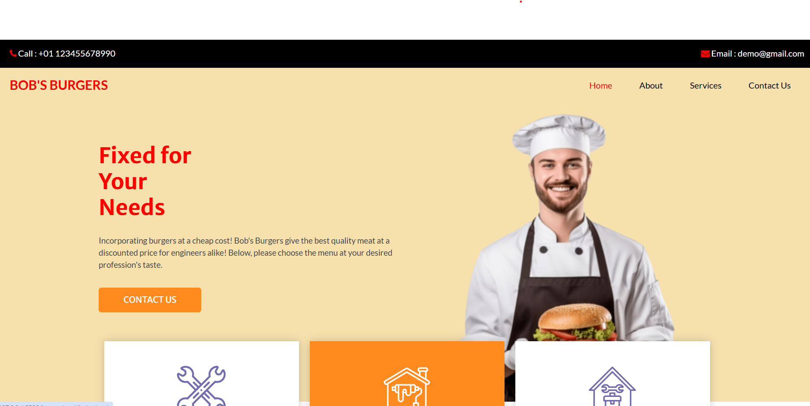

<h1 align="center">Template Website</h1>

  <h3>
    <a href="https://ande-glitch.github.io/Media-Query-2/">
      Link to project
    </a>
  </h3>

<!-- TABLE OF CONTENTS -->

## Table of Contents

- [Overview](#overview)
- [Built With](#built-with)
- [Features](#features)
- [How to use](#how-to-use)
- [Contact](#contact)

<!-- OVERVIEW -->
## Overview
A template downloaded on Free CSS and edited according to preference. 

### Template
- [Free CSS](https://www.free-css.com/free-css-templates/page296/inance)

## Features
- Redirecting links
- Google Maps function
- Media Query
- Color Adaption (hover)

## How To Use

- Change size accordingly to change the website's look and structure.

## Contact
- GitHub [Ande-Glitch](https://github.com/Ande-glitch)
- Epost [And Nguyen](mailto:andnguyen24@outlook.com)

## Result

